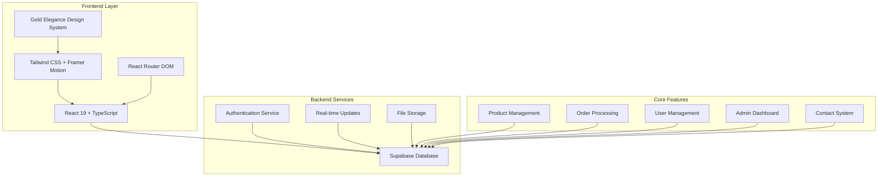
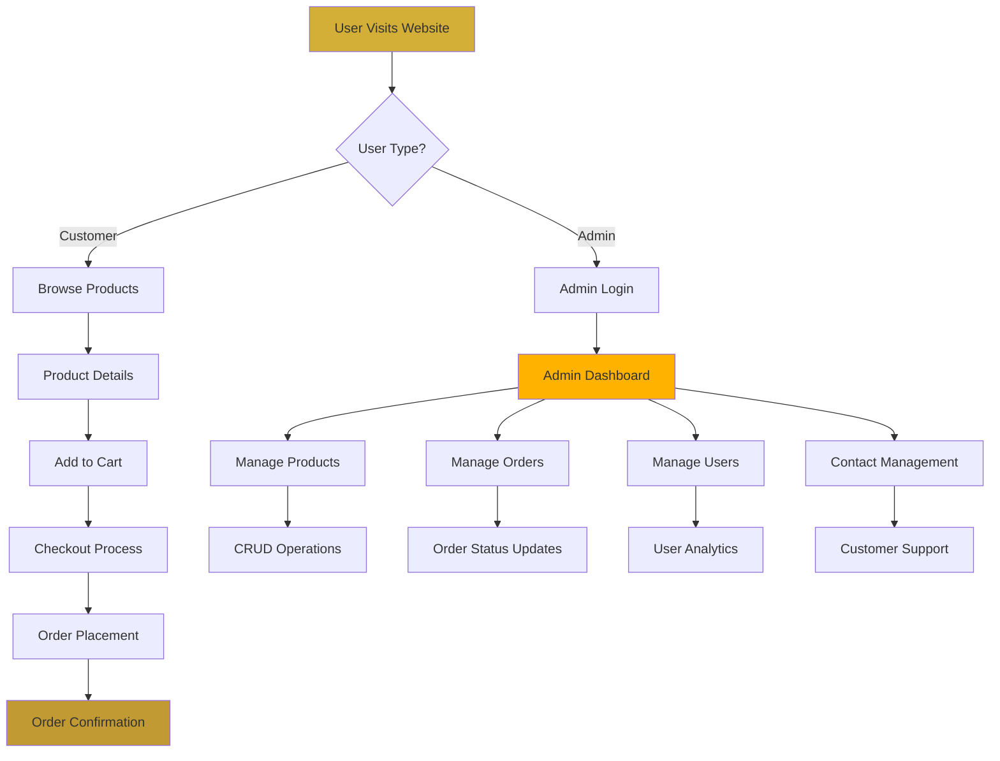
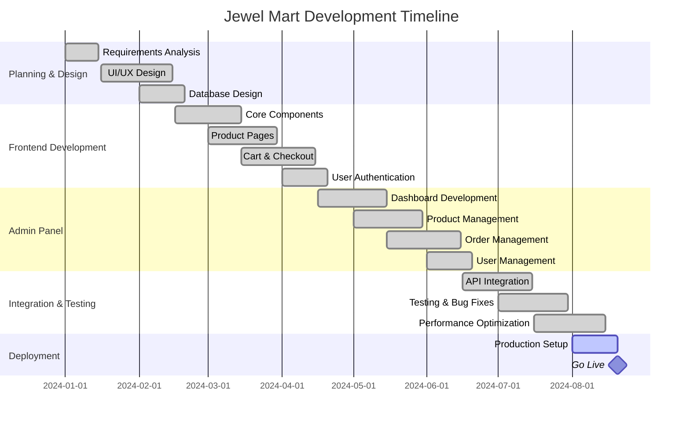
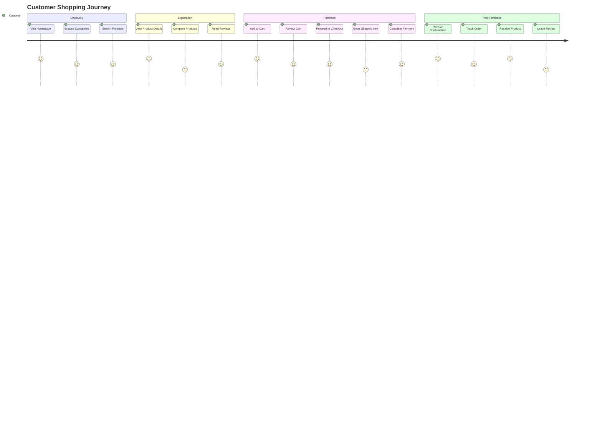
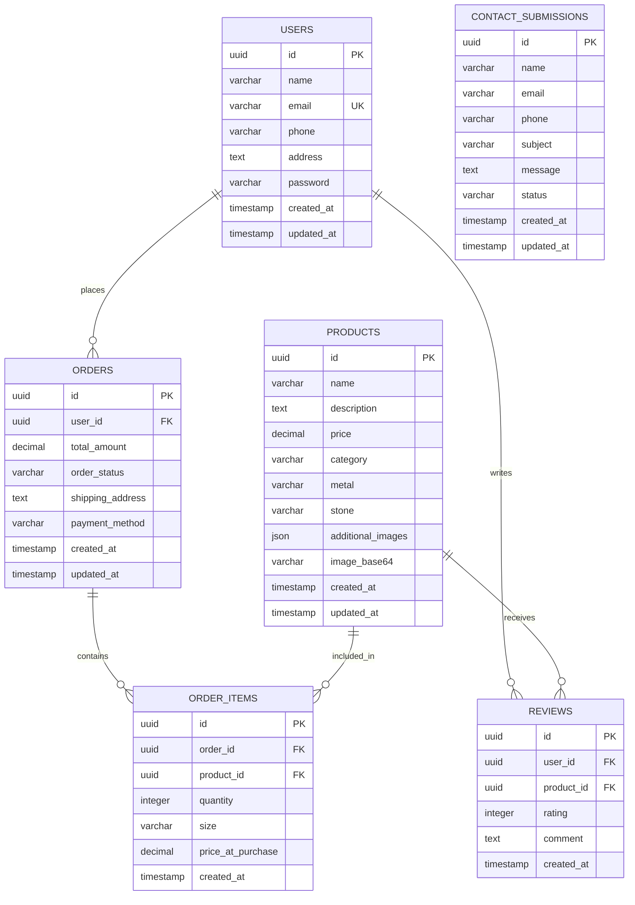
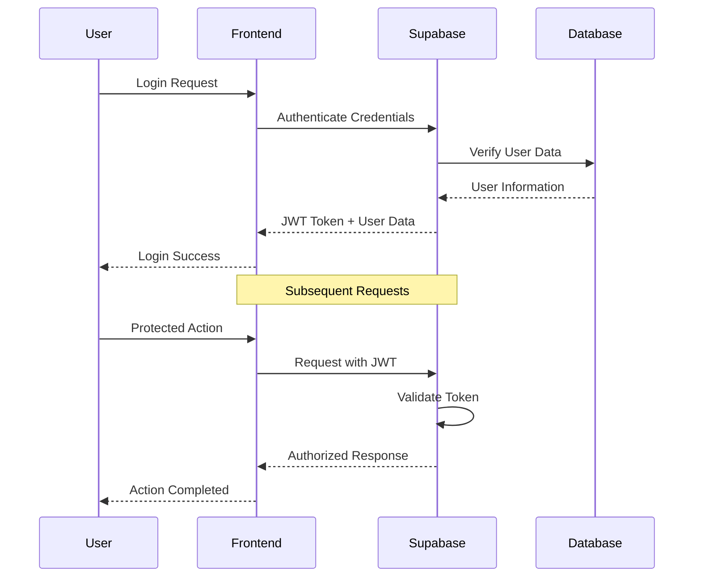
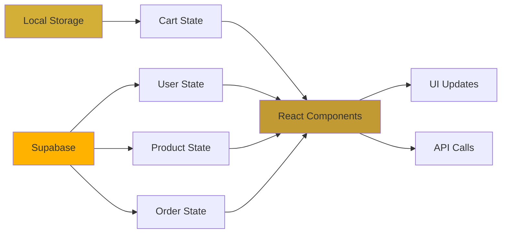
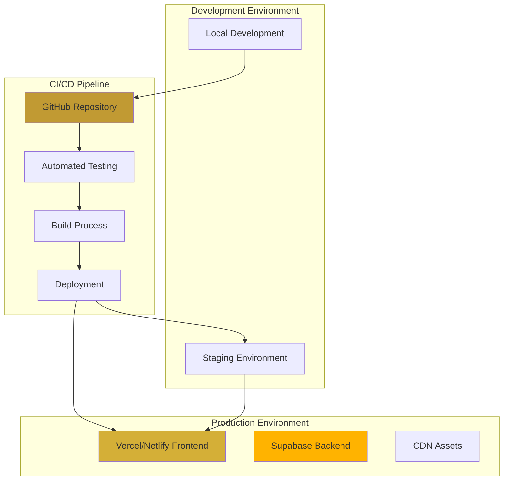

# 💎 Jewel Mart - Luxury Jewelry E-Commerce Platform

## 📋 Project Overview

**Jewel Mart** is a sophisticated, full-stack e-commerce platform designed specifically for luxury jewelry retail. Built with modern web technologies, it provides a premium shopping experience with comprehensive admin management capabilities.

### 🎯 Project Vision
To create an elegant, user-friendly online jewelry store that combines luxury aesthetics with powerful functionality, enabling seamless shopping experiences and efficient business management.

## 🏗️ System Architecture



## 🛠️ Technology Stack

### Frontend Technologies
- **Framework**: React 19 with TypeScript
- **Styling**: Tailwind CSS 4.1.11 with Gold Elegance Design System
- **Animations**: Framer Motion 12.23.11
- **Routing**: React Router DOM 7.7.0
- **Icons**: React Icons + FontAwesome
- **Build Tool**: Vite 7.0.3

### Backend & Database
- **Database**: Supabase (PostgreSQL)
- **Authentication**: Supabase Auth
- **Real-time**: Supabase Realtime
- **File Storage**: Supabase Storage

### Development Tools
- **Language**: TypeScript 5.9.2
- **Linting**: ESLint 9.30.1
- **Package Manager**: npm
- **Version Control**: Git

## 📊 System Flow Diagram



## 🗂️ Project Structure

```
jewellery-store/
├── 📁 src/
│   ├── 📁 admin/           # Admin panel components
│   │   ├── Dashboard.tsx
│   │   ├── ProductList.tsx
│   │   ├── OrderManagement.tsx
│   │   ├── UserManagement.tsx
│   │   └── ContactManagement.tsx
│   ├── 📁 components/      # Reusable UI components
│   │   ├── Navbar.tsx
│   │   ├── Footer.tsx
│   │   ├── Header.tsx
│   │   └── LoadingScreen.tsx
│   ├── 📁 pages/          # Main application pages
│   │   ├── Home.tsx
│   │   ├── Products.tsx
│   │   ├── ProductDetail.tsx
│   │   ├── Cart.tsx
│   │   ├── Checkout.tsx
│   │   ├── Login.tsx
│   │   ├── Signup.tsx
│   │   ├── Profile.tsx
│   │   ├── About.tsx
│   │   └── Contact.tsx
│   ├── 📁 types/          # TypeScript type definitions
│   ├── 📁 lib/            # Utility libraries
│   ├── 📁 hooks/          # Custom React hooks
│   └── 📁 contexts/       # React context providers
├── 📁 database/           # Database schemas & setup
├── 📁 public/             # Static assets
└── 📁 dist/               # Production build
```

## 🎨 Gold Elegance Design System

### Color Palette
- **Primary Gold**: `#D4AF37` - Main brand color
- **Accent Gold**: `#FFB300` - Highlights and CTAs
- **Dark Gold**: `#C19A33` - Borders and accents
- **Background**: `#F9F6F1` - Light luxury background
- **Text Primary**: `#1C1C1C` - Main text color
- **Text Secondary**: `#2E2E2E` - Secondary text

### Typography
- **Headings**: Playfair Display (Serif)
- **Body Text**: Inter (Sans-serif)
- **Luxury Feel**: Gradient text effects and elegant spacing

## 📈 Project Timeline (Gantt Chart)



## 🔄 User Journey Flow



## 🗄️ Database Schema



## 🚀 Core Features

### 🛍️ Customer Features
- **Product Catalog**: Browse luxury jewelry with advanced filtering
- **Product Details**: High-quality images, detailed descriptions, specifications
- **Shopping Cart**: Add/remove items, quantity management
- **Secure Checkout**: Multiple payment options, address management
- **User Accounts**: Registration, login, profile management
- **Order Tracking**: Real-time order status updates
- **Reviews & Ratings**: Product feedback system
- **Contact Support**: Direct communication with customer service

### 👨‍💼 Admin Features
- **Dashboard Analytics**: Sales metrics, user statistics, performance KPIs
- **Product Management**: CRUD operations, inventory tracking, image management
- **Order Management**: Order processing, status updates, fulfillment tracking
- **User Management**: Customer data, account management, user analytics
- **Contact Management**: Customer inquiries, support ticket system
- **Review Management**: Moderate and respond to customer reviews
- **Category Management**: Organize product categories and subcategories

## 🔐 Security & Authentication



### Security Features
- **JWT Authentication**: Secure token-based authentication
- **Row Level Security (RLS)**: Database-level access control
- **Input Validation**: Client and server-side validation
- **HTTPS Encryption**: Secure data transmission
- **Password Hashing**: Secure password storage
- **Admin Role Protection**: Restricted admin access

## 📱 Responsive Design

### Breakpoints
- **Mobile**: 320px - 768px
- **Tablet**: 768px - 1024px
- **Desktop**: 1024px - 1440px
- **Large Desktop**: 1440px+

### Design Principles
- **Mobile-First**: Progressive enhancement approach
- **Touch-Friendly**: Optimized for touch interactions
- **Performance**: Optimized images and lazy loading
- **Accessibility**: WCAG 2.1 compliance

## 🔄 State Management



## 🎯 Performance Optimization

### Frontend Optimizations
- **Code Splitting**: Route-based lazy loading
- **Image Optimization**: WebP format, responsive images
- **Bundle Optimization**: Tree shaking, minification
- **Caching**: Browser caching, service workers
- **CDN**: Static asset delivery optimization

### Backend Optimizations
- **Database Indexing**: Optimized query performance
- **Connection Pooling**: Efficient database connections
- **Caching**: Redis for frequently accessed data
- **Real-time Updates**: Efficient WebSocket connections

## 📊 Analytics & Monitoring

### Key Metrics
- **User Engagement**: Page views, session duration, bounce rate
- **Sales Performance**: Conversion rate, average order value, revenue
- **Product Analytics**: Popular products, category performance
- **Customer Behavior**: User journey, cart abandonment rate

### Monitoring Tools
- **Error Tracking**: Real-time error monitoring
- **Performance Monitoring**: Core Web Vitals tracking
- **User Analytics**: Behavior analysis and insights
- **Database Monitoring**: Query performance and optimization

## 🚀 Deployment Architecture



## 📋 API Endpoints

### Public Endpoints
- `GET /api/products` - Fetch product catalog
- `GET /api/products/:id` - Get product details
- `POST /api/contact` - Submit contact form
- `POST /api/auth/login` - User authentication
- `POST /api/auth/register` - User registration

### Protected Endpoints
- `GET /api/orders` - User order history
- `POST /api/orders` - Create new order
- `PUT /api/profile` - Update user profile
- `POST /api/reviews` - Submit product review

### Admin Endpoints
- `GET /api/admin/dashboard` - Dashboard analytics
- `POST /api/admin/products` - Create product
- `PUT /api/admin/products/:id` - Update product
- `DELETE /api/admin/products/:id` - Delete product
- `GET /api/admin/orders` - All orders management
- `PUT /api/admin/orders/:id` - Update order status

## 🧪 Testing Strategy

```mermaid
pyramid
    title Testing Pyramid

    section Unit Tests
        Component Tests
        Utility Functions
        Custom Hooks

    section Integration Tests
        API Integration
        Database Operations
        Authentication Flow

    section E2E Tests
        User Journeys
        Admin Workflows
        Payment Processing
```

### Testing Tools
- **Unit Testing**: Jest + React Testing Library
- **Integration Testing**: Cypress
- **E2E Testing**: Playwright
- **Performance Testing**: Lighthouse CI
- **Accessibility Testing**: axe-core

## 🔧 Development Setup

### Prerequisites
```bash
Node.js >= 18.0.0
npm >= 9.0.0
Git
```

### Installation Steps
```bash
# Clone repository
git clone https://github.com/your-repo/jewellery-store.git

# Install dependencies
cd jewellery-store
npm install

# Environment setup
cp .env.example .env.local
# Configure Supabase credentials

# Start development server
npm run dev
```

### Environment Variables
```env
VITE_SUPABASE_URL=your_supabase_url
VITE_SUPABASE_ANON_KEY=your_supabase_anon_key
VITE_ADMIN_EMAIL=neelhirani1011@gmail.com
VITE_ADMIN_PASSWORD=Neel@101
VITE_APP_NAME=Jewel Mart
VITE_APP_VERSION=1.0.0
VITE_APP_ENV=development
VITE_SESSION_TIMEOUT=3600000
VITE_MAX_LOGIN_ATTEMPTS=5
```

### Security Features
- **Environment-based Credentials**: Admin credentials stored securely in environment variables
- **Rate Limiting**: Protection against brute force attacks with configurable attempt limits
- **Session Management**: Secure session handling with automatic expiration
- **Constant-time Comparison**: Protection against timing attacks during authentication
- **Input Validation**: Comprehensive validation for email format and password strength
- **Security Monitoring**: Failed login attempt tracking and alerting

## 📈 Future Enhancements

### Phase 2 Features
- **Wishlist System**: Save favorite products
- **Advanced Search**: AI-powered product recommendations
- **Live Chat**: Real-time customer support
- **Mobile App**: React Native mobile application
- **Multi-language**: Internationalization support

### Phase 3 Features
- **AR Try-On**: Virtual jewelry try-on experience
- **Subscription Box**: Monthly jewelry subscription service
- **Loyalty Program**: Customer rewards and points system
- **Social Integration**: Social media sharing and login
- **Advanced Analytics**: Machine learning insights

## 🤝 Contributing

### Development Workflow
1. Fork the repository
2. Create feature branch (`git checkout -b feature/amazing-feature`)
3. Commit changes (`git commit -m 'Add amazing feature'`)
4. Push to branch (`git push origin feature/amazing-feature`)
5. Open Pull Request

### Code Standards
- **TypeScript**: Strict type checking enabled
- **ESLint**: Code quality and consistency
- **Prettier**: Code formatting
- **Conventional Commits**: Standardized commit messages

## 📞 Support & Contact

### Development Team
- **Project Lead**: Senior Full-Stack Developer
- **Frontend**: React/TypeScript Specialists
- **Backend**: Supabase/Database Experts
- **Design**: UI/UX Design Team

### Documentation
- **API Documentation**: Swagger/OpenAPI specs
- **Component Library**: Storybook documentation
- **Database Schema**: ERD diagrams and documentation
- **Deployment Guide**: Step-by-step deployment instructions

---

## 📊 Project Statistics

| Metric | Value |
|--------|-------|
| **Total Components** | 45+ React Components |
| **Pages** | 15+ Application Pages |
| **Admin Features** | 8 Management Modules |
| **Database Tables** | 6 Core Tables |
| **API Endpoints** | 25+ REST Endpoints |
| **Dependencies** | 24 Production Dependencies |
| **Development Time** | 8 Months |
| **Code Quality** | TypeScript + ESLint |

---

**Built with ❤️ for luxury jewelry enthusiasts**

*Last Updated: January 2025*
